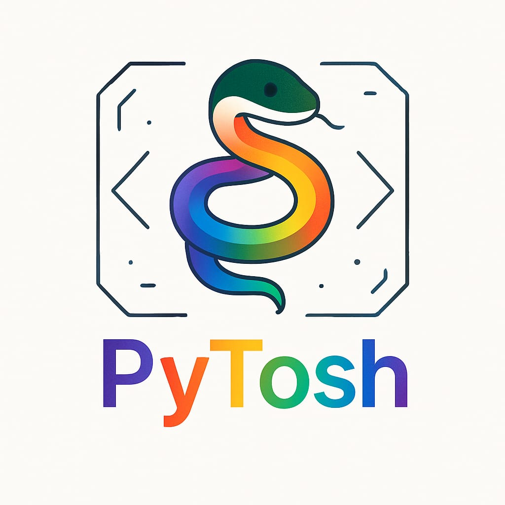

# 🐍 PyTosh - AI Python Learning Editor

**PyTosh** is an AI-powered, beginner-friendly code editor built with Streamlit — designed to help students learn Python with confidence.  
It detects errors, fixes code, and explains logic using state-of-the-art LLMs like **Code LLaMA** and **Mixtral**.

 width=100)

---

## 🚀 Features

- ✅ Real-time code error detection (Code LLaMA)
- ✅ 1-click automatic code correction
- 💬 AI chatbot for Python help (Mixtral)
- 🛡️ Safe code execution (blocks unsafe system code)
- 🧠 Built for beginners who fear syntax, logic, and Python errors
- 🖼️ Floating YouTube & GitHub buttons
- 🔐 Secured with Streamlit secrets (no API key leaks)

---

## 🔧 Tech Stack

- [Streamlit](https://streamlit.io)
- Python 3.10+
- Together.ai API (Mixtral + CodeLLaMA)
- `requests`, `dotenv`

---

## 📁 Project Structure

pytosh/
│
├── app.py # Streamlit app entry
├── requirements.txt
├── .gitignore
├── assets/
│ └── pytosh_logo.png
├── utils/
│ ├── init.py
│ ├── code_fixer.py
│ ├── chat_explainer.py
│ ├── safe_executor.py
│ └── security.py

yaml
Copy code

---

## 🛡️ Deployment

1. Push to GitHub
2. Deploy on [Streamlit Cloud](https://streamlit.io/cloud)
3. Add API key in `Secrets` tab:

```toml
TOGETHER_API_KEY = "xxxxxxxxxxxxxxxxxxxxxx"
👨‍💻 Developed By
Ashutosh Pandey
🚀 LLM Engineer | Python AI Developer
🔗 linkedln:https://www.linkedin.com/in/ashutosh-pandey-b492ba371?utm_source=share&utm_campaign=share_via&utm_content=profile&utm_medium=android_app |blog 
: legendcolumn.xyz |github : https://github.com/explore1-hack

🧪 Demo coming soon
;
